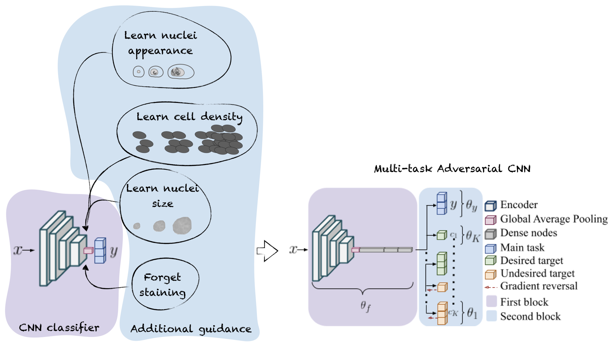

<!--
*** Thanks for checking out the Best-README-Template. If you have a suggestion
*** that would make this better, please fork the repo and create a pull request
*** or simply open an issue with the tag "enhancement".
*** Thanks again! Now go create something AMAZING! :D
***
***
***
*** To avoid retyping too much info. Do a search and replace for the following:
*** github_username, repo_name, twitter_handle, email, project_title, project_description
-->


<!-- PROJECT SHIELDS -->
<!--
*** I'm using markdown "reference style" links for readability.
*** Reference links are enclosed in brackets [ ] instead of parentheses ( ).
*** See the bottom of this document for the declaration of the reference variables
*** for contributors-url, forks-url, etc. This is an optional, concise syntax you may use.
*** https://www.markdownguide.org/basic-syntax/#reference-style-links
-->
[![Contributors][contributors-shield]][contributors-url]
[![Forks][forks-shield]][forks-url]
[![Stargazers][stars-shield]][stars-url]
[![Issues][issues-shield]][issues-url]
[![MIT License][license-shield]][license-url]
[![LinkedIn][linkedin-shield]][linkedin-url]
[](https://zenodo.org/badge/latestdoi/284033732)


<!-- PROJECT LOGO -->
<br />
<p align="center">
  <a href="https://github.com/maragraziani/MICCAI2021_replicate">
    
  </a>

  <h3 align="center">Multi-task and Adversarial CNN Training: Learning Interpretable Pathology Features Improves CNN Generalization</h3>

  <p align="center">
    With physicians being accountable for the diagnosis, it is fundamental that CNNs ensure that relevant pathology features are being considered.  
Building on top of successfully existing techniques such as multi-task learning, domain adversarial training and concept-based interpretability, we addresses the challenge of introducing diagnostic factors in the training objectives.
The architecture in this repo learns end-to-end an uncertainty-based weighting combination of multi-task and adversarial losses. 
  This can be used to encourage the model to focus on pathology features such as density and pleomorphism of nuclei, e.g. variations in size and appearance, while discarding misleading features such as staining differences.
    <br />
    <a href="https://github.com/maragraziani/multitask_adversarial"><strong>Explore the docs »</strong></a>
    <br />
    <br />
    <a href="https://github.com/maragraziani/multitask_adversarial/notebooks">View Examples</a>
    ·
    <a href="https://github.com/maragraziani/multitask_adversarial/issues">Report Bug</a>
    ·
  </p>
</p>


<!-- TABLE OF CONTENTS -->
<details open="open">
  <summary><h2 style="display: inline-block">Table of Contents</h2></summary>
  <ol>
    <li>
      <a href="#about-the-project">About The Project</a>
      <ul>
        <li><a href="#built-with">Based Upon</a></li>
      </ul>
    </li>
    <li>
      <a href="#getting-started">Getting Started</a>
      <ul>
        <li><a href="#prerequisites">Prerequisites</a></li>
      </ul>
    </li>
    <li><a href="#usage">Usage</a></li>
    <li><a href="#license">License</a></li>
    <li><a href="#contact">Contact</a></li>
    <li><a href="#acknowledgements">Acknowledgements</a></li>
  </ol>
</details>


<!-- ABOUT THE PROJECT -->
## About The Paper
Our Regression Concept Vectors toolbox (https://github.com/maragraziani/rcvtool) generates explanations about the relevance of a given concept to the decision making of a CNN classifier. No possibility is given to act on the training process and modify the learning of a concept. 
The architecture in this paper aims at filling this gap, allowing us to discourage the learning of a confounding concept, e.g. domain, staining, watermarks, and to encourage the learning of discriminant concepts.
The architecture merges the developmental efforts of three successful techniques, namely multi-task learning [1], adversarial training [2] and high-level concept learning in internal network features [3,4].
This architecture is trained on the histopathology task of breast cancer classification, with the aim of enforcing the learning of diagnostic features that match the physicians' diagnosis procedure, such as nuclei morphology and density. 

### Based Upon

* [1]() Caruana, Rich. "Multitask learning." Machine learning 28.1 (1997): 41-75.
* [2]() Ganin, Yaroslav, et al. "Domain-adversarial training of neural networks." The journal of machine learning research 17.1 (2016): 2096-2030.
* [3]() Kim, Been, et al. "Interpretability beyond feature attribution: Quantitative testing with concept activation vectors (tcav)." International conference on machine learning. PMLR, 2018.
* [4]() Graziani, Mara, Vincent Andrearczyk, and Henning Müller. "Regression concept vectors for bidirectional explanations in histopathology." Understanding and Interpreting Machine Learning in Medical Image Computing Applications. Springer, Cham, 2018. 124-132.

<!-- GETTING STARTED -->
## Getting Started

To get a local copy up and running follow these simple steps.

### Prerequisites

This code was developed in Python 3.6 and using Tensorflow 2. You will also need some standard packages to replicate the experiments. Follow the instructions in **Installation** to set the environment 

### Installation
Installation should take ~20 minutes on a normal laptop.
1. Clone the repo
   ```sh
   git clone https://github.com/maragraziani/multitask_adversarial
   ```
2. Install python packages with pip 
    ```sh
    pip install -r requirements.txt
    pip install https://storage.googleapis.com/tensorflow/mac/cpu/tensorflow-1.8.0-py3-none-any.whl
    pip install keras==2.2.4
    pip install -U --force-reinstall --no-dependencies git+https://github.com/datumbox/keras@bugfix/trainable_bn 
    ```

<!-- USAGE EXAMPLES -->
## Usage

Training the baseline model
 ```sh
   bash routines/train_baseline.sh EXPERIMENT_NAME SEED
   ```
Expected outcome in: 
 ```sh
    results/EXPERIMENT_NAME
│   ├── catalog
│   ├── catalog.old
│   ├── docbook-xml.xml
│   ├── docbook-xml.xml.old
│   ├── sgml-data.xml
│   ├── sgml-data.xml.old
│   ├── xml-core.xml
│   └── xml-core.xml.old
         
   ```

 ```sh
   python train_multitask_adversarial.py GPU_INDEX EXPERIMENT_NAME UNDESIRED_TARGET DESIRED_TARGETS
   ```
 For example will run the CNN with domain-adversarial training and the additional learning of nuclei count:
 
  ```sh
   python train_multitask_adversarial.py 0 DOMAIN-COUNT  domain count
   ```

For more examples, please refer to the [Notebooks](https://github.com/maragraziani/multitask_adversarial/tree/main/notebooks) folder

# Reproducibility

To replicate baseline results (in Table x)
 ```sh
   bash replicate_baseline.sh
   ```
To replicate multi-task adversarial results (in Table x)
 ```sh
   bash replicate_mta.sh
   ```  


<!-- LICENSE -->
## License

Distributed under the MIT License. See `LICENSE` for more information.

<!-- CONTACT -->
## Contact

Mara Graziani - [@mormontre](https://twitter.com/mormontre) - mara.graziani@hevs.ch

<!-- ACKNOWLEDGEMENTS -->
## Cite our work

If you make use of the code, please cite our paper in your work

```
TBD
```


<!-- MARKDOWN LINKS & IMAGES -->
<!-- https://www.markdownguide.org/basic-syntax/#reference-style-links -->
[contributors-shield]: https://img.shields.io/github/contributors/maragraziani/multitask_adversarial.svg?style=for-the-badge
[contributors-url]: https://github.com/maragraziani/multitask_adversarial/graphs/contributors
[forks-shield]: https://img.shields.io/github/forks/maragraziani/multitask_adversarial.svg?style=for-the-badge
[forks-url]: https://github.com/maragraziani/multitask_adversarial/network/members
[stars-shield]: https://img.shields.io/github/stars/maragraziani/multitask_adversarial.svg?style=for-the-badge
[stars-url]: https://github.com/maragraziani/multitask_adversarial/stargazers
[issues-shield]: https://img.shields.io/github/issues/maragraziani/MICCAI2021_replicate.svg?style=for-the-badge
[issues-url]: https://github.com/maragraziani/multitask_adversarial/issues
[license-shield]: https://img.shields.io/github/license/maragraziani/MICCAI2021_replicate.svg?style=for-the-badge
[license-url]: https://github.com/maragraziani/multitask_adversarial/blob/master/LICENSE.txt
[linkedin-shield]: https://img.shields.io/badge/-LinkedIn-black.svg?style=for-the-badge&logo=linkedin&colorB=555
[linkedin-url]: https://linkedin.com/in/mara-graziani-878980105/


